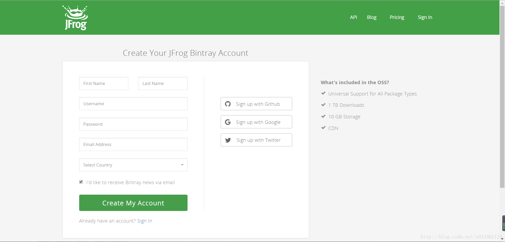
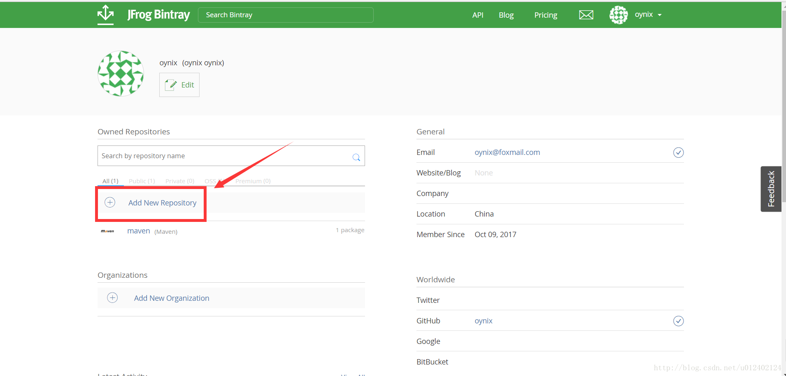
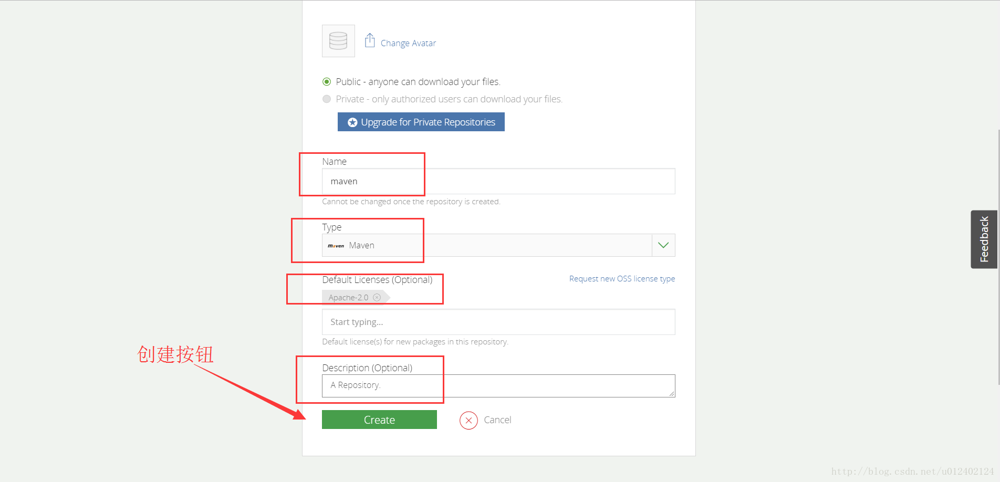
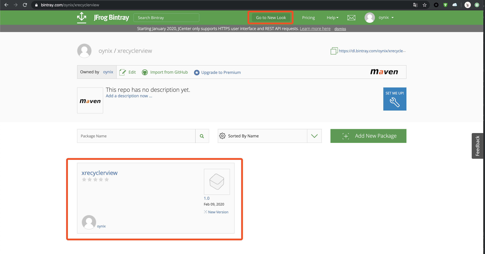
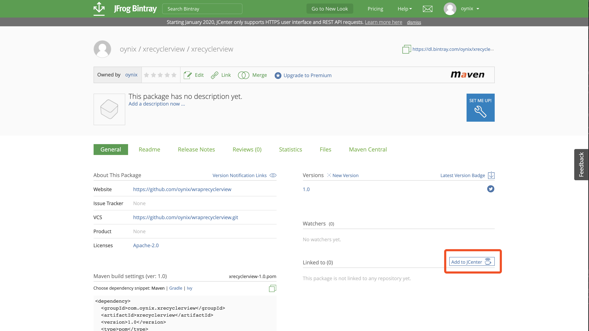

## 发布代码到JCenter

JCenter是Groovy默认的源，发布到JCenter的库直接通过implementation就可以导入，像上篇文章中讲的发布到JitPack的库，需要添加JitPack源之后才能找到并导入。但是一旦导入后，跟从哪导入的就没什么区别了。

整个流程大致分成了5个步骤。

1. 注册Bintray账号并创建仓库
2. 准备开源库
3. 配置参数
4. 编译并上传至Bintray
5. linked to JCenter

### 1. 注册Bintray账号并创建仓库 （1/5）

注册地址，[https://bintray.com/signup/oss](https://bintray.com/signup/oss)
如下，没有别的就选择Github就好



登录成功后，如下：

- Owned Repositories：自己拥有的仓库
- Organizations：参与的组织
- General：个人信息

点击 `Add New Repository` 来新建一个仓库



创建仓库的页面如下：

- Name：仓库名称，类似于Github的仓库名称
- Type：仓库类型，选择 Maven
- Licnese：开源协议，按需选择
- Description：简单描述，选填

填写完成后点击 Create，第一步到此完成。



### 2. 准备开源库 (2/5)

Android Studio 中新建一个项目，创建完成后，此时项目中有一个 moudle，类型为 application，取名为sample。然后再添加一个 moudle，类型为 Android Library，按需起名，此处起名为 mylibrary。至此，项目中有两个 moudle，一个是放开源库代码的 mylibrary，一个是用来写示例的 sample。

将开源库代码写到 mylibrary 中，在 sample 中写使用示例，并调试通过。至此，第二步完成。

### 3. 配置参数 （3/5）

1. 修改项目根目录下的 `build.gradle` 文件，添加下面两行，上传代码时需要使用这两个库：

   - 第一行是 [maven github](https://github.com/dcendents/android-maven-gradle-plugin) 地址，添加时可查看最新版本

   - 第二行是 [gradle github](https://github.com/bintray/gradle-bintray-plugin) 地址，添加时可查看最新版本

```groovy
buildscript {
       repositories {
           google()
           jcenter()
           mavenCentral()
       }
       dependencies {
           classpath 'com.android.tools.build:gradle:3.2.1'
      
           // NOTE: Do not place your application dependencies here; they belong
           // in the individual module build.gradle files
           classpath 'com.github.dcendents:android-maven-gradle-plugin:2.1'
           classpath 'com.jfrog.bintray.gradle:gradle-bintray-plugin:1.+'
       }
      }
```
   
2. 配置 Bintray 账号信息，即开源库即将上传到哪，以及开发者信息。配置信息写到项目根目录下的 `local.properties` 文件中，这个文件默认添加到了 `.gitignore` 中，如果没有请自行创建并添加到 `.gitignore` 中，因为其中包含个人账号信息：

   ```properties
   # bintray user and key
   bintray.user=oynix
   bintray.apikey=xxxxxxxxxxxxxxxxxxxxxx
   
   # developer
   developer.id=oynix
   developer.name=oynix
   developer.email=oynix@foxmail.com
   ```

   - `bintray.user`：Bintray 注册的用户名，在 Bintray 页面右上角
   - `bintray.apikey`：Bintray 的 API Key，Bintray 页面右上角 Edit Profile -> API Key
   - `developer.id`：开源社区的昵称
   - `developer.name`：姓名
   - `developer.email`：邮箱地址

3. 配置 Project 信息，该信息与项目相关，不涉及个人信息，所以配置信息写到 moudle 目录下的 project.properties 文件中，如果没有该文件请自行创建，注意该文件不用添加到 .gitignore 中：

   ```properties
   # project
   project.name=xrecylerview
   project.groupId=com.oynix.xrecyclerview
   project.artifactId=xrecyclerView
   project.packaging=arr
   project.siteUrl=https://github.com/oynix/wraprecyclerview
   project.gitUrl=https://github.com/oynix/wraprecyclerview.git
   
   # javadoc
   javadoc.name=xrecyclerview
   ```

   - `project.name`：开源库名称
   - `project.groupId`：项目组ID，写包名
   - `project.artifactId`：项目ID，写 moudle 名
   - `project.packaging`：打包方式，写 arr
   - `project.siteUrl`：项目主页，没有就写 Github 地址
   - `project.gitUrl`：项目仓库地址
   - `javadoc.name`：javadoc主页显示的名称，写项目名字就好

4. 上传操作的配置信息，即，上面的所有配置信息和上传操作这二者间的桥梁。在开源库 moudle 目录下新建 `bintrayUpload.gradle` 文件，添加以下内容：

   ```groovy
   apply plugin: 'com.github.dcendents.android-maven'
   apply plugin: 'com.jfrog.bintray'
   
   // load project properties
   Properties properties = new Properties()
   File projectPropertiesFile = project.file("project.properties")
   if(projectPropertiesFile.exists()){
       properties.load(projectPropertiesFile.newDataInputStream())
   }
   
   def projectName = properties.getProperty("project.name")
   def projectGroupId = properties.getProperty("project.groupId")
   def projectArtifactId = properties.getProperty("project.artifactId")
def projectVersionName = android.defaultConfig.versionName
   def projectPackaging = properties.getProperty("project.packaging")
   def projectSiteUrl = properties.getProperty("project.siteUrl")
   def projectGitUrl = properties.getProperty("project.gitUrl")
   def javadocName = properties.getProperty("javadoc.name")
   
   // load developer properties
   File localPropertiesFile = project.rootProject.file("local.properties")
   if(localPropertiesFile.exists()){
       properties.load(localPropertiesFile.newDataInputStream())
   }
   
   def developerId = properties.getProperty("developer.id")
   def developerName = properties.getProperty("developer.name")
   def developerEmail = properties.getProperty("developer.email")
   def bintrayUser = properties.getProperty("bintray.user")
   def bintrayApikey = properties.getProperty("bintray.apikey")
   
   
   group = projectGroupId
   
   // This generates POM.xml with proper parameters
   install {
       repositories.mavenInstaller {
           pom {
               project {
                   name projectName
                   groupId projectGroupId
                   artifactId projectArtifactId
                   version projectVersionName
                   packaging projectPackaging
                   url projectSiteUrl
                   licenses {
                       license {
                           name 'The Apache Software License, Version 2.0'
                           url 'http://www.apache.org/licenses/LICENSE-2.0.txt'
                       }
                   }
                   developers {
                       developer {
                           id developerId
                           name developerName
                           email developerEmail
                       }
                   }
                   scm {
                       connection projectGitUrl
                       developerConnection projectGitUrl
                       url projectSiteUrl
                   }
               }
           }
       }
   }
   
   // This generates sources.jar
   task sourcesJar(type: Jar) {
       from android.sourceSets.main.java.srcDirs
       classifier = 'sources'
   }
   
   task javadoc(type: Javadoc) {
       source = android.sourceSets.main.java.srcDirs
       classpath += project.files(android.getBootClasspath().join(File.pathSeparator))
   }
   
   // This generates javadoc.jar
   task javadocJar(type: Jar, dependsOn: javadoc) {
       classifier = 'javadoc'
       from javadoc.destinationDir
   }
   
   artifacts {
       archives javadocJar
       archives sourcesJar
   }
   
   // javadoc configuration
   javadoc {
       options{
           encoding "UTF-8"
           charSet 'UTF-8'
           author true
           version projectVersionName
           links "http://docs.oracle.com/javase/7/docs/api"
           title javadocName
       }
   }
   
   // bintray configuration
   bintray {
       user = bintrayUser
       key = bintrayApikey
       configurations = ['archives']
       pkg {
           repo = "xrecyclerview"
           name = projectName
           websiteUrl = projectSiteUrl
           vcsUrl = projectGitUrl
           licenses = ["Apache-2.0"]
           publish = true
       }
   }
   
   ```
   
   以上内容基本不用改变什么，除了 bintray 节点的 repo 的值，要与第一步在 Bintray 上创建的仓库名称保持一致
   
5. 在开源库 moudle 下的 `build.gradle` 文件末尾添加一行，然后 `Sync` 一下

   ```groovy
   apply from 'bintrayUpload.gradle'
   ```

### 4. 编译并上传至 Bintray

- 编译：打开 AndroidStudio 的 Terminal 窗口，项目根目录下执行：

  ```shell
  ./gradlew install
  ```

  成功后会有 `BUILD SUCCESSFUL` 的提示，如果报错如下

  ```shell
  * What went wrong:
  Execution failed for task ':xrecyclerview:javadoc'.
  > Javadoc generation failed. Generated Javadoc options file 
  ```

  则在项目根目录下的文件 `build.gradle` 末尾添加一行，注意其中的 moudle 名称，再次执行上面的命令

  ```groovy
  tasks.getByPath(":xrecyclerview:javadoc").enabled = false
  ```

- 上传至 Bintray，同样在 Terminal 中执行

  ```shell
  ./gradlew bintrayUpload
  ```

  成功后会有 `BUILD SUCCESSFUL` 的提示

  至此，第四步完成。

### 5. Linked to JCenter

- 打开 Bintray，点一下第一步创建的仓库，就可以看到刚刚上传的 package 了，如果与下面图片不一样，可以点一下标题中部的 `Go to Old Look` 按钮

  
  
- 点进去之后，会看到如图所示的页面，点击其中的 `Add to jCenter` 按钮，如果找不到，就点一下标题中间的 `Go to Old Look` 按钮

  
  
- 在接下来的页面中点击 `Send` 按钮，在这就不截图了。发送完成之后耐心等待，成功之后会收到站内信提醒，信中会告诉你结果。如果成功，则在项目中便可以直接导入使用了

  ```groovy
  implementation 'com.oynix.xrecyclerview:xrecyclerview:1.0'
  ```

  


（完）

