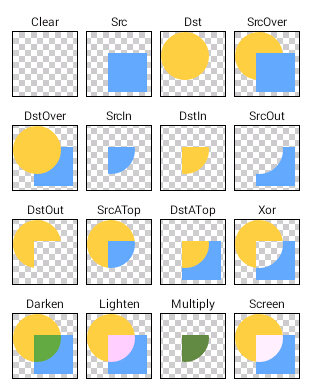
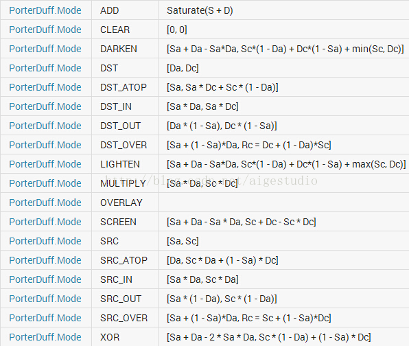
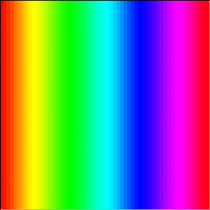
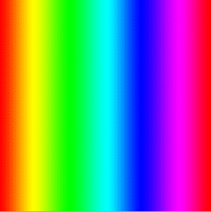
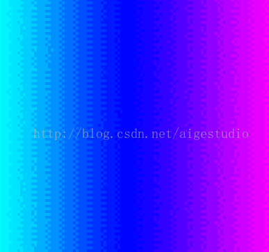
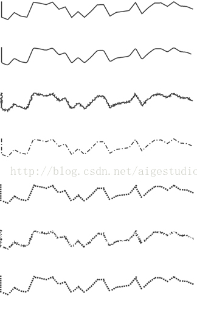

# Paint常用方法说明

原文地址：[https://blog.csdn.net/aigestudio/article/details/41316141](https://blog.csdn.net/aigestudio/article/details/41316141)，写的很详细。这里只挑出一些常用的，难于理解的，单独拿出来做个笔记。

* [Paint常用方法说明](#paint常用方法说明)
      * [setAntiAlias(boolean aa)](#setantialiasboolean-aa)
      * [setColorFilter(ColorFilter filter)](#setcolorfiltercolorfilter-filter)
         * [ColorMatricColorFilter](#colormatriccolorfilter)
         * [LighingColorFilter](#lighingcolorfilter)
         * [PorterDuffColorFilter](#porterduffcolorfilter)
      * [setXfermode(Xfermode xfermode)](#setxfermodexfermode-xfermode)
         * [AvoidXfermode](#avoidxfermode)
            * [AvoidXfermode.Mode.TARGET](#avoidxfermodemodetarget)
            * [AvoidXfermode.Mode.AVOID](#avoidxfermodemodeavoid)
         * [PixelXorXfermode](#pixelxorxfermode)
         * [PorterDuffXfermode](#porterduffxfermode)
            * [PorterDuff.Mode.ADD](#porterduffmodeadd)
            * [PorterDuff.Mode.CLEAR](#porterduffmodeclear)
            * [PorterDuff.Mode.DARKEN](#porterduffmodedarken)
            * [PorterDuff.Mode.DST](#porterduffmodedst)
            * [PorterDuff.Mode.DST_ATOP](#porterduffmodedst_atop)
            * [PorterDuff.Mode.DST_IN](#porterduffmodedst_in)
            * [PorterDuff.Mode.DST_OUT](#porterduffmodedst_out)
            * [PorterDuff.Mode.DST_OVER](#porterduffmodedst_over)
            * [PorterDuff.Mode.LIGHTEN](#porterduffmodelighten)
            * [PorterDuff.Mode.MULTIPLY](#porterduffmodemultiply)
            * [PorterDuff.Mode.OVERLAY](#porterduffmodeoverlay)
            * [PorterDuff.Mode.SCREEN](#porterduffmodescreen)
            * [PorterDuff.Mode.SRC](#porterduffmodesrc)
            * [PorterDuff.Mode.SRC_ATOP](#porterduffmodesrc_atop)
            * [PorterDuff.Mode.SRC_IN](#porterduffmodesrc_in)
            * [PorterDuff.Mode.SRC_OUT](#porterduffmodesrc_out)
            * [PorterDuff.Mode.SRC_OVER](#porterduffmodesrc_over)
            * [PorterDuff.Mode.XOR](#porterduffmodexor)
            * [总结](#总结)
      * [setDither(boolean dither)](#setditherboolean-dither)
      * [setMaskFilter(MaskFilter maskFilter)](#setmaskfiltermaskfilter-maskfilter)
         * [BlurMaskFilter](#blurmaskfilter)
      * [setPathEffect(PathEffect effect)](#setpatheffectpatheffect-effect)
      * [setStrokeCap(Paint.Cap cap)](#setstrokecappaintcap-cap)
      * [setShadowLayer(float radius, float dx, float dy, int shadowColor)](#setshadowlayerfloat-radius-float-dx-float-dy-int-shadowcolor)
      * [setShader(Shader shader)](#setshadershader-shader)
         * [BitmapShader](#bitmapshader)
         * [LinearGradient](#lineargradient)
         * [SweepGradient](#sweepgradient)
         * [RadialGradient](#radialgradient)
         * [ComposeShader](#composeshader)
      * [Metrix](#metrix)
         * [setTranslate scale](#settranslate-scale)
         * [preTranslate scale](#pretranslate-scale)
         * [postTranslate scale](#posttranslate-scale)

## setAntiAlias(boolean aa)

设置抗锯齿。也可以在 new 的时候传入 Paint.ANTI_ALIAS_FLAG。

## setColorFilter(ColorFilter filter)

类 ColorFilter 没有具体实现，它有三个子类：

### ColorMatricColorFilter

矩阵颜色过滤器，在 Android 中图片是以 RGBA 像素点的形式加载到内存中的，修改这些橡塑信息需要一个 ColorMatrix 类的支持，其定义了一个 4x5 的 float[] 类型的矩阵：

```java
ColorMatrix colorMatric = new ColorMatrix(new float[]{
  1, 0, 0, 0, 0,// R
  0, 1, 0, 0, 0,// G
  0, 0, 1, 0, 0,// B
  0, 0, 0, 1, 0,// A
});
```

其中，第一行表示 R(红色) 的向量，第二行表示 G(红色) 的向量，第三行表示 B(蓝色) 的向量，最后一行表示 A(透明度) 的向量，这一顺序是固定的，不可改变。每一行的前 4 个值表示的是 RGBA 的值，其范围在 0.0F 至 2.0F 之间，1 为保持原图的 RGB 的值。每一行的第 5 个表示偏移值，想让颜色更倾向于某个颜色时，就增加该颜色的偏移值。

> 何为偏移值？顾名思义当我们想让颜色更倾向于红色的时候就增大R向量中的偏移值，想让颜色更倾向于蓝色的时候就增大B向量中的偏移值，这是最最朴素的理解，但是事实上色彩偏移的概念是基于白平衡来理解的，什么是白平衡呢？说得简单点就是白色是什么颜色！如果大家是个单反爱好者或者会些PS就会很容易理解这个概念，在单反的设置参数中有个色彩偏移，其定义的就是白平衡的色彩偏移值，就是当你去拍一张照片的时候白色是什么颜色的，在正常情况下白色是（255, 255, 255, 255）但是现实世界中我们是无法找到这样的纯白物体的，所以在我们用单反拍照之前就会拿一个我们认为是白色的物体让相机记录这个物体的颜色作为白色，然后拍摄时整张照片的颜色都会依据这个定义的白色来偏移！而这个我们定义的“白色”（比如：255, 253, 251, 247）和纯白（255, 255, 255, 255）之间的偏移值（0, 2, 4, 8）我们称之为白平衡的色彩偏移。

ColorMetrix 类里面提供一些实在的方法，如 setSaturation(float sat) 设置饱和度。

### LighingColorFilter

光照颜色过滤，该类只有一个构造方法：

```java
LightingColorFilter(int mul, int add)
```

其中 mul 的全称是 colorMultiply 意为色彩倍增，add 全称是 colorAdd 意为色彩增加，这两个值都是 16 进制的色彩值 0xAARRGGBB。

### PorterDuffColorFilter

同 LightingColorFilter 一样，只有一个构造方法：

```java
PorterDuffColorFilter(int color, PorterDuff.Mode mode)
```

接受两个值，一个是 16 进制的颜色值，另一个是 PorterDuff 内部类 Mode 中的常量值，表示混合模式。Mode 不仅仅应用于色彩混合，还应用于图形混合，如果在 PorterDuffColorFilter 中强行设置图形混合的模式，将不会看到任何对应的效果。

## setXfermode(Xfermode xfermode)

Xfermode，可以直接理解为图像混合模式，它没有具体实现，但有 3 个子类，这 3 个子类实现的功能比 setColorFilter 的 3 个子类复杂

### AvoidXfermode

这个 API 因为不支持硬件加速所以在 API 16 已经过时了，如果想在高于 16 的机器上使用，必须关闭硬件加速，可以在 [HardwareAccelerate](https://developer.android.com/guide/topics/graphics/hardware-accel.html) 文档中查看如何关闭硬件加速，以及查看更多不支持硬件加速的 API。

AvoidXfermode 只有一个含参的构造方法：

```java
AvoidXfermode(int opColor, int tolerance, AvoidXfermode.Mode mode)
```

具体实现和 ColorFilter 一样都被封装在 C/C++ 内，我们只管调用就好。第一个参数 opColor 表示一个 16 进制的可以带透明通道的颜色值，第二个参数 tolerance 表示容差值，可以理解为一个标识「精确」或「模糊」的东西，最后一个参数 AvoidXfermode 表示具体模式，可选值只有两个：AvoidXfermode.Mode.AVOID 或 AvoidXfermode.Mode.TARGET

#### AvoidXfermode.Mode.TARGET

在该模式下 Android 会判断画布上的颜色是否有跟 opColor 一样的颜色，比如 opColor 是红色，TARGET 模式下就会判断画布上是否有存在红色的地方，如果有则把该区域「染」上一层画笔定义的颜色，否则不「染」色，而 tolerance 容差值则表示画布上的像素和 opColor 之间的差别是多少的时候才去「染」，比如当前画布有一个像素的色值是(200, 20, 13)，而 opColore 是 (255, 0, 0)，当 tolerance 容差值为 255 时，即便(200, 20, 13)并不等于 opColor 也会被染色，容差值越大「染」色范围越广。

#### AvoidXfermode.Mode.AVOID

与 TARGET 恰恰相反，TARGET 是与 opColor 与画布颜色一样，而 AVOID 是 opColor 与 画布颜色不一样，其他的都类似。

### PixelXorXfermode

与 AvoidXfermode 一样也在 API 16 过时了，该类也提供了一个含参的构造方法

```java
PixelXorXfermode(int opColor)
```

该类的计算实现很简单，从官方给出的计算公式来看就是：op^src^dst，像素色值按位异或运算

### PorterDuffXfermode

Xfermode的最后一个子类也是唯一一个没有过时切沿用至今的子类。该类同样只有一个构造方法：

```
PorterDuffXfermode(PorterDuff.Mode mode)
```

其中的 PorterDuff.Mode 和上面讲的 ColorFilter 用到的 PorterDuff.Mode 是一样的。PorterDuffXfermode 就是图形混合模式的意思，其概念最早来自 SIGGRAPH 的 Tomas Porter 和 Tom Duff，名字就是这两个人的名字的组合



这张图片从一定程度上形象地说明了图形混合的作用，两个图形一圆一方通过一定的计算产生不同的组合效果，在 API 中 Android 提供了 18 种（比上图多了两种 ADD 和 OVERPLAY）模式：



Sa 全称 Source Alpha，Sc 全称 Source Color，Da 全称 Destination Alpha，Dc 全称 Destination Color。每个中括号由两个值组成：[Alpha, Color]。

Source 为源图像，意为将要绘制的图像；Destination 为目标图像，意为将源图像绘制到的图像。简单理解，先绘制的是 dst，后绘制的是 src。

#### PorterDuff.Mode.ADD

计算方式：Saturate（S + D），饱和度相加

#### PorterDuff.Mode.CLEAR

计算方式：[0, 0]，清除

#### PorterDuff.Mode.DARKEN

计算方式：[Sa + Da - Sa * Da, Sc * (1 - Da) + Dc * (1 - Sa) + min(Sc, Dc)]，变暗

两个图像混合，较深颜色总是会覆盖较浅的颜色，如果两者深浅相同则混合，例如，黄色覆盖了红色而蓝色和青色因为是跟透明度混合所以不变。DARKEN 模式的应用在图像色彩方面比较广泛，我们可以利用其特性来获得不同的成像效果，这点与 ColorFilter 有点类似。

#### PorterDuff.Mode.DST

计算方式：[Da, Dc]，只绘制目标图像

#### PorterDuff.Mode.DST_ATOP

计算方式：[Sa, Sa * Dc + Sc * (1 - Da)]，在源图像和目标图像相交的地方绘制目标图像，而在不相交的地方绘制源图像

#### PorterDuff.Mode.DST_IN

计算方式：[Sa * Da, Sa * Dc]，只在源图像和目标图像相交的地方绘制目标图像

最常见的应用就是蒙板绘制，利用源图作为蒙板扣出目标图上的图像

#### PorterDuff.Mode.DST_OUT

计算方式：[Da * (1 - Sa), Dc * (1 - Sa)]，只在源图像和目标图像不相交的地方绘制目标图像

#### PorterDuff.Mode.DST_OVER

计算方式：[Sa + (1 - Sa) * Da, Rc = Dc + (1 - Da) * Sc]， 在源图像的上方绘制目标图像，就是两个图片谁在上谁在下的意思

#### PorterDuff.Mode.LIGHTEN

计算方式：[Sa + Da - Sa * Da, Sc * (1 - Da) + Dc * (1- Sa) + max(Sc, Dc)]，变亮，与 DARKEN 相反

#### PorterDuff.Mode.MULTIPLY

计算方式：[Sa * Da, Sc * Dc]，正片叠底。该模式通俗的计算方式很简单，源图像像素颜色乘以目标图像像素色值除以 255 即得混合后图像像素的颜色值，该模式在设计领域应用广泛，因为其特性：黑色与任何颜色混合都会得黑色，在手绘的上色、三维东湖的 UV 贴图绘制都有应用。

#### PorterDuff.Mode.OVERLAY

计算方式：未给出，叠加。官方 API DEMO 没有给出，谷歌也没有给出其计算方式，在实际效果中其对亮色和暗色不起作用，也就是说黑白色无效，它会将源色与目标色混合产生一种中间色，这种中间色生成的规律也很简单，如果源色比目标色暗，那么让目标色的颜色倍增否则递减。

#### PorterDuff.Mode.SCREEN

计算方式：[Sa + Da - Sa * Da, Sc + Dc - Sc * Dc]，滤色，让图像娇柔幻化，色彩均和

#### PorterDuff.Mode.SRC

计算方式：[Sa, Sc]，绘制源图像

#### PorterDuff.Mode.SRC_ATOP

计算方式：[Da, Sc * Da + (1 - Sa) * Dc]，在源图像和目标图像相交的地方绘制源图像，在不相交的地方绘制目标图像

#### PorterDuff.Mode.SRC_IN

计算方式：[Sa * Da, Sc * Da]，只在源图像和目标图像相交的地方绘制源图像

#### PorterDuff.Mode.SRC_OUT

计算方式：[Sa * (1 - Da), Sc * (1 -Da)]，只在源图像和目标图像不相交的地方绘制源图像

#### PorterDuff.Mode.SRC_OVER

计算方式：[Sa + (1 - Sa) * Da, Rc = Sc + (1 - Sa) * Dc]，在目标图像的顶部绘制源图像

#### PorterDuff.Mode.XOR

计算方式：[Sa + Da - 2 * Sa * Da, Sc * (1 - Da) + (1 - Sa) * Dc]，在源图像和目标图像重叠之外的任何地方绘制他们，而在不重叠的地方绘制任何内容

#### 总结

OVER：谁在上谁在下的问题

IN：绘制相交部分，SRC_IN绘制SRC，DST_IN绘制DST

OUT：绘制不相交部分，SRC_OUT绘制SRC，DST_OUT绘制DST

ATOP：SRC_ATOP只绘制SRC中相交部分，DST_ATOP只绘制DST中相交部分

## setDither(boolean dither)

设置绘制图像时的抗抖动，也称为递色

设置前



设置后



放大来看，其在很多相邻像素之间插入了一个中间值，使颜色过渡变得些许柔和



## setMaskFilter(MaskFilter maskFilter)

MaskFilter 类中没有任何实现方法，它有两个子类 BlurMaskFilter 和 EmbossMaskFilter，前者为模糊遮罩滤镜，而后者为浮雕遮罩滤镜，不支持硬件加速

### BlurMaskFilter

只有一个含参的都早方法

```java
BlurMaskFilter(float radisu, BlurMaskFilter.Blur style)
```

其中 radius 表示阴影半径，值越大越扩散。第二个参数 style 表示模糊类型，有四种选择：SOLD 效果是在图像的 Alpha 边界产生一层与 Paint 颜色一致的阴影效果而不影响图像本身；NORMAL 会将整个图像模糊掉；OUTER 会在 Alpha 边界外产生一层阴影且会将原本的图像变得透明；INNER 则会在图像内部产生模糊，很少用

如上所说 BlurMaskFilter 是根据 Alpha 通道的边界来计算模糊的，如果是一张图片（注：Android 会把复制到资源目录的图片转为 RGB565）你会发现没有任何效果，那么如何给图片加一个类似阴影的效果呢？其实很简单，可以尝试从 Bitmap 中获取其 Alpha 通道，并在绘制 Bitmap 前先以该 Alpha 通道绘制一个模糊就可以了

```java
public class BlurMaskFilterView extends View {
	private Paint shadowPaint;// 画笔
	private Context mContext;// 上下文环境引用
	private Bitmap srcBitmap, shadowBitmap;// 位图和阴影位图
 
	private int x, y;// 位图绘制时左上角的起点坐标
 
	public BlurMaskFilterView(Context context) {
		this(context, null);
	}
 
	public BlurMaskFilterView(Context context, AttributeSet attrs) {
		super(context, attrs);
		mContext = context;
		// 记得设置模式为SOFTWARE
		setLayerType(LAYER_TYPE_SOFTWARE, null);
 
		// 初始化画笔
		initPaint();
 
		// 初始化资源
		initRes(context);
	}
 
	/**
	 * 初始化画笔
	 */
	private void initPaint() {
		// 实例化画笔
		shadowPaint = new Paint(Paint.ANTI_ALIAS_FLAG | Paint.DITHER_FLAG);
		shadowPaint.setColor(Color.DKGRAY);
		shadowPaint.setMaskFilter(new BlurMaskFilter(10, BlurMaskFilter.Blur.NORMAL));
	}
 
	/**
	 * 初始化资源
	 */
	private void initRes(Context context) {
		// 获取位图
		srcBitmap = BitmapFactory.decodeResource(context.getResources(), R.drawable.a);
 
		// 获取位图的Alpha通道图
		shadowBitmap = srcBitmap.extractAlpha();
 
		/*
		 * 计算位图绘制时左上角的坐标使其位于屏幕中心
		 */
		x = MeasureUtil.getScreenSize((Activity) mContext)[0] / 2 - srcBitmap.getWidth() / 2;
		y = MeasureUtil.getScreenSize((Activity) mContext)[1] / 2 - srcBitmap.getHeight() / 2;
	}
 
	@Override
	protected void onDraw(Canvas canvas) {
		super.onDraw(canvas);
		// 先绘制阴影
		canvas.drawBitmap(shadowBitmap, x, y, shadowPaint);
 
		// 再绘制位图
		canvas.drawBitmap(srcBitmap, x, y, null);
	}
}
```

## setPathEffect(PathEffect effect)

PathEffect 很明显就是路径效果的意思，其一共有六个子类，效果如下



从上到下：未设置PathEffect，CornerPathEffect，DiscretePathEffect，DashPathEffect，PathDashPathEffect，ComposePathEffect，SumPathEffect

## setStrokeCap(Paint.Cap cap)

设置画笔笔触风格，ROUND，SQUARE 和 BUTT

##setStrokeJoin(Paint.Join join)

设置结合处的形态

## setShadowLayer(float radius, float dx, float dy, int shadowColor)

为绘制的图形添加一个阴影层效果，不支持硬件加速

## setShader(Shader shader)

着色器，有五个子类

### BitmapShader

只有一个含参的构造方法，其他 4 个子类都有两个

```java
BitmapShader(Bitmap bitmap, Shader.TileMode tileX, Shader.TileMode tileY)
```

Shader.TileMode 有三种：CLAMP 拉伸，MIRROR 镜像和 REPEAT 重复

### LinearGradient

线性渐变

```java
LinearGradient(float x0, float y0, float x1, float y1, int color0, int color1, Shader.TileMode tile)
```

(x0, y0) 渐变的起点，(x1, y1) 渐变的终点，color0 起点颜色，color1 终点颜色

```java
LinearGradient(float x0, float y0, float x1, float y1, int[] colors, float[] positions, Shader.TileMode tile)
```

colors 表示支持多个颜色，positons 表示各个颜色的分界位置，如 {Color.RED, Color.GREEN, Color.BLUE}，{0, 0.3F, 0.8F}，positions 为null 时均分渐变区域

### SweepGradient

梯度渐变，也称扫描式渐变，累死雷达扫描效果

```java
SweepGradient(float cx, float cy, int color0, int color1)

SweepGradient(float cx, float cy, int[] colors, float[] positons)
```

同 LinearGradient

### RadialGradient

径向渐变，从圆心中心向四周渐变的效果，构造方法就先写一个，同上

```java
RadialGradient(float cx, float cy, float radius, int centerColor, int edgeColor, Shader.TileMode tile);
```

### ComposeShader

组合 Shader

```java
ComposeShasdr(Shader s0, Shader s1, Xfermode mode);
ComposeShader(Shader s0, Shader s1, PorterDuff.Mode mode)
```

## Metrix

3 x 3 坐标矩阵，初始值:

```java
new float[]{
  1, 0, 0, // x
  0, 1, 0, // y
  0, 0, 1, // 1
}
```

第一列表示 x 轴方向缩放，第二列表示 y 轴方向缩放，第三列表示偏移

### setTranslate scale

### preTranslate scale

### postTranslate scale