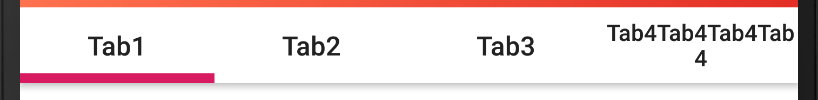
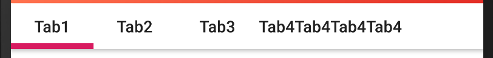
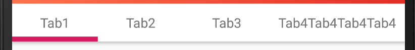
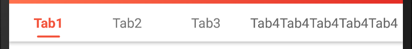

# TabLayout按需分配自身的宽度

### 1. 前言

TabLayout 有两种模式：`fixed` 和 `scrollable`。

`fixed` 模式下，将宽度均分给各个 Tab，但 Tab  的所需宽度各不相同，若均分就会出现这种情况：



`scrollable` 模式下，按需分配宽度，title 越长则所占宽度越宽，但无法保证刚好占满 TabLayout：



**目标效果**，按需给各个 Tab 分配宽度，同时要把 TabLayout 占满且**刚好占满**：




- 思路

  Tab 里的 TabView 是不可修改的，但 Tab 提供了一个 customView，customView 可自定义，所以通过使用这个 customView 替换原 TabView， 来达到目标效果。

  方式：先按需分配，文字多宽就分配多少，然后再将 TabLayout 剩下的宽度等比分给各个 Tab 即可。

### 2. 实现  `TabLayoutUtils.expandTabWidth(TabLayout tabLayout)`

1. 替换 TabView

   ```java
   // 用customView替换
   for (int i = 0; i < tabLayout.getTabCount(); i++) {
     TabLayout.Tab tab = tabLayout.getTabAt(i);
     tab.setCustomView(getTabView(context, tab.getText()));
   }
   
   // getTabView为生成customView的方法
   private View getTabView(Context context, CharSequence title) {
     TextView view = new TextView(context);
     view.setText(title);
     view.setGravity(Gravity.CENTER);
     return view;
   }
   ```


2. 计算已使用的宽度

   ```java
   int width = View.MeasureSpec.makeMeasureSpec(0, View.MeasureSpec.UNSPECIFIED);
   int height = Viwe.MeasureSpec.makeMeasureSpec(0, View.MeasureSpec.UNSPECIFIED);
   tabLayout.measure(width, height);
   
   int used = tabLayout.getMeasuredWidth();
   ```

3. 分配剩余的宽度

   ```java
   // 这里TabLayout的宽度按照一个屏幕的宽度计算
   int total = tabLayout.getContext().getResources().getDisplayMetrics().widthPixels;
   int extra = (total - used) / tabLayout.getTabCount();
   
   // 修改customeView的LayoutParams参数
   if (extra > 0) {
     for (int i = 0; i < tabLayout.getTabCount(); i++) {
       TabLayout.Tab tab = tabLayout.getTabAt(i);
       ViewGroup.LayoutParams lp = tab.getCustomView().getLayoutParams();
       lp.width = tab.getCustomView().getMeasuredWidth() + extra;
       tab.getCustomView().setLayoutParams(lp);
     }
   }
   ```

### 3. 调用

```java
TabLayoutUtils.expandTabWidth(tabLayout);
```

### 4. 选中效果

因为使用自定义的 customView，所以选中效果也需要自定义，监听 Tab 的选中状态，对应做出改变

```java
TabLayout.addOnTabSelectedListener(new TabLayout.OnTabSelectedListener() {
  @Override
  public void onTabSelected(TabLayout.Tab tab) {
    TabLayoutUtils.selectTab(tab);
  }
  
  @Override
  public void onTabUnselected(TabLayout.Tab tab) {
    TabLayoutUtils.unselectTab(tab);
  }
  
  @Override
  public void onTabReselected(TabLayout.Tab tab) {}
});
```

### 5. 完整代码

[TabLayoutUtils.java](TabLayoutUtils.java)

说明：完整代码中除了自定义 Tab Title，同时还自定了 Tab Indicator，原 Indictor 在 TabLayout底边，现调整了其在垂直方向的位置，不足之处是没实现滑动时的动效。

比较简单，不再赘述，最终效果如下：

