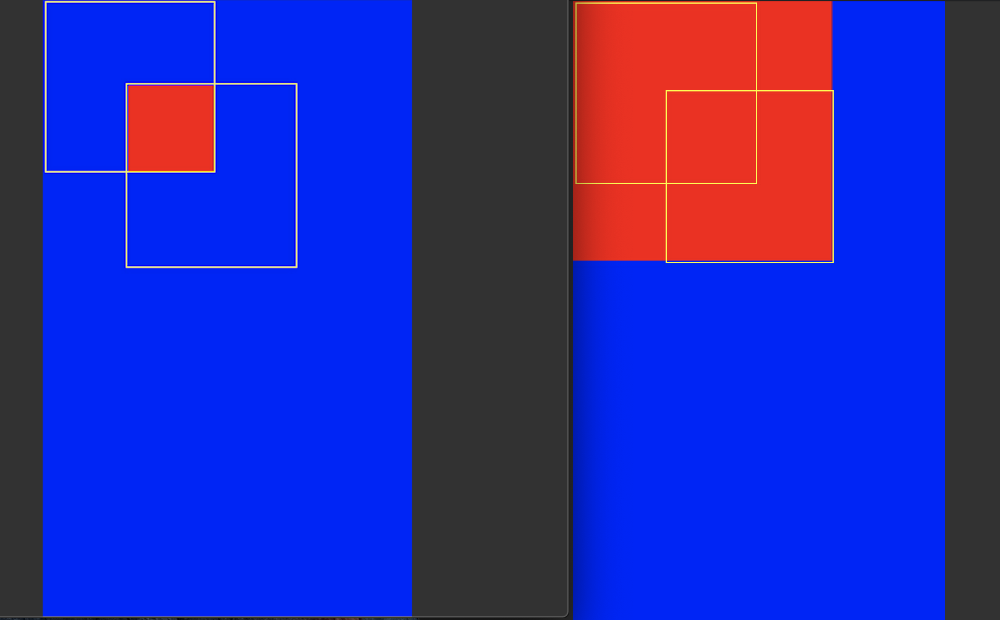

# Canvas常用方法说明

原文地址[https://blog.csdn.net/aigestudio/article/details/41960507](https://blog.csdn.net/aigestudio/article/details/41960507)


   * [Canvas常用方法说明](#canvas常用方法说明)
      * [drawBitmapMesh(Bitmap bitmap, int meshWidth, int meshHeight, float[] verts, int vertOffset, int[] colors, int colorOffset, Paint paint)](#drawbitmapmeshbitmap-bitmap-int-meshwidth-int-meshheight-float-verts-int-vertoffset-int-colors-int-coloroffset-paint-paint)
      * [clipRect(int left, int top, int right, int bottom)](#cliprectint-left-int-top-int-right-int-bottom)
      * [clipRect(float left, float top, float right, float bottom)](#cliprectfloat-left-float-top-float-right-float-bottom)
      * [clipRect(Rect rect)](#cliprectrect-rect)
      * [clipRect(RectF rect)](#cliprectrectf-rect)
         * [Rect.intersect](#rectintersect)
         * [Rect.union](#rectunion)
      * [Path](#path)
         * [Path.quadTo(float x0, float y0, float x1, float y1)](#pathquadtofloat-x0-float-y0-float-x1-float-y1)
         * [PAth.cubicTo(float x0, float y0, float x1, float y1, float x2, float y2)](#pathcubictofloat-x0-float-y0-float-x1-float-y1-float-x2-float-y2)
         * [Path.arcTo(RectF oval, float startAngle, float sweepAngle)](#patharctorectf-oval-float-startangle-float-sweepangle)
         * [Path.rCubicTo](#pathrcubicto)
         * [Path.rLineTo](#pathrlineto)
         * [Path.rMoveTo](#pathrmoveto)
         * [Path.rQuadTo](#pathrquadto)
         * [Path.addXXX](#pathaddxxx)
      * [clipPath(Path path, Region.Op op)](#clippathpath-path-regionop-op)
         * [Region.Op.DIFFERENCE](#regionopdifference)
         * [Region.Op.INTERSECT](#regionopintersect)
         * [Region.Op.REPLACE](#regionopreplace)
         * [Region.Op.REVERSE_DIFFERENCE](#regionopreverse_difference)
         * [Region.Op.UNION](#regionopunion)
         * [Region.Op.XOR](#regionopxor)
      * [Rect Region](#rect-region)
      * [saveFlag 6个](#saveflag-6个)
         * [ALL_SAVE_FLAG](#all_save_flag)
         * [CLIP_SAVE_FLAG](#clip_save_flag)
         * [MATRIX_SAVE_FLAG](#matrix_save_flag)
         * [CLIP_TO_LAYER_SAVE_FLAG](#clip_to_layer_save_flag)
         * [FULL_COLOR_LAYER_SAVE_FLAG](#full_color_layer_save_flag)
         * [HAS_ALPHA_LAYER_SAVE_FLAG](#has_alpha_layer_save_flag)
         * [总结](#总结)
      * [save() 和 restore()](#save-和-restore)
      * [setMatrix](#setmatrix)

## drawBitmapMesh(Bitmap bitmap, int meshWidth, int meshHeight, float[] verts, int vertOffset, int[] colors, int colorOffset, Paint paint)

mesh 网格，meshWidth 表示横向网格数量，meshHeight 表示纵向网格数量，verts 表示分割网格的线条的交点，每个点有两个坐标，所以 verts 长度是交点数量 x 2：[x0, y0, x1, y1, .....xn-1, yn-1]


如果平分这些网格，均匀排列这些点，绘制出来的就是原图，如果改变其中一个点的坐标，或一些点的坐标，绘制出来的图片就会发生一些改变


可以使用此方法实现很多效果，如错切，平移，旋转等

## clipRect(int left, int top, int right, int bottom)

## clipRect(float left, float top, float right, float bottom)

裁剪矩形，参数为矩形左上角坐标和右下角坐标

## clipRect(Rect rect)

## clipRect(RectF rect)

按矩形裁剪

### Rect.intersect

### Rect.union

这两个方法返回值是一个新矩形，这个矩形是由相交区域左上角的点，和右下角的点确定的



## Path

### Path.quadTo(float x0, float y0, float x1, float y1)

二阶贝塞尔曲线，x0，y0 为控制点，x1，y1 为终点

### PAth.cubicTo(float x0, float y0, float x1, float y1, float x2, float y2)

三阶贝塞尔曲线，x0y0 为第一个控制点，x1y1 为第二个控制点，x2y2 为终点

### Path.arcTo(RectF oval, float startAngle, float sweepAngle)

###Path.arcTo(RectF oval, float startAngle, float sweepAngle, boolean forceMoveTo)

Path 是连续的，第三个参数表示是否强制连接画弧前的点与弧的起点

### Path.rCubicTo

### Path.rLineTo

### Path.rMoveTo

### Path.rQuadTo

r 开头的方法，relative 表示原点为当前的终点，不是 r 开头的方法，原点是 (0, 0)

### Path.addXXX

添加一段 path 到当前 path，不会和当前 path 连接，其中参数 Path.Direction 可选值有 CCW 和 CW，分别表示逆时针和顺时针

## clipPath(Path path, Region.Op op)

### Region.Op.DIFFERENCE

最终区域为第一个区域与第二个区域不同的区域

### Region.Op.INTERSECT

最终区域为第一个区域与第二个区域相交的区域

### Region.Op.REPLACE

最终区域为第二个区域

### Region.Op.REVERSE_DIFFERENCE

最终区域为第二个区域与第一个区域不同的区域

### Region.Op.UNION

最终区域为第一个区域加第二个区域

### Region.Op.XOR

最终区域为第一个区域加第二个区域减去两者相交的区域

## Rect Region

缩放画布，Rect 会随同缩放，Region 不会

## saveFlag 6个

### ALL_SAVE_FLAG

save 和 saveLayerXXX 通用，保存所有

### CLIP_SAVE_FLAG

save 和 saveLayerXXX 通用，裁减标识

### MATRIX_SAVE_FLAG

save 和 saveLayerXXX 通用，变换标识

### CLIP_TO_LAYER_SAVE_FLAG

只适用 saveLayerXXX，表示对当前图层执行裁剪操作需要对齐图层边界

### FULL_COLOR_LAYER_SAVE_FLAG

只适用 saveLayerXXX，表示当前图层的色彩模式至少需要是 8 位色

### HAS_ALPHA_LAYER_SAVE_FLAG

只适用 saveLayerXXX，表示在当前图层中将需要使用逐像素 Alpha 混合模式

### 总结

save，saveLayer 和 saveLayerAlpha 都返回一个 int 类型的值，该返回值为当前操作的唯一 ID 编号，可以利用 restoreToCount(int saveCount) 方法来指定还原时候还原哪一个操作

## save() 和 restore()

每调用一次 save 都会生成一个 countID，根据传入的 FLAG 来保存一些当前画布的状态信息，如传入 ALL_SAVE_FLAG 则会保存画布的所有状态信息，传入 CLIP_SAVE_FLAG 则会保存画布的裁剪状态，如果执行过裁剪那么之后的绘制都只会在裁剪后的画布上，这些状态信息与这个 countID 唯一对应。

 countID 采用栈式存储，每调用一次 restore，都会从栈顶弹出一个 countID，然后画布就会恢复到这个 countID 对应的画布状态。如调用一次 save 方法返回 id1，这时对画布执行一些操作，旋转，平移，然后调用一次 restore，或 restoreToCount(id1)，画布便会恢复到 id1 对应的状态

## setMatrix

```java
Matrix matrix = new Matrix();
matrix.setScale(0.5f, 0.3f);
matrix.postTranslate(100, 100);
canvas.setMatrix(matrix);

```

