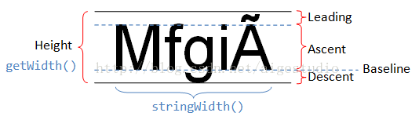

# Paint中有关Text的方法说明

原文地址：[https://blog.csdn.net/aigestudio/article/details/41447349](https://blog.csdn.net/aigestudio/article/details/41447349)

[TOC]

## FontMetrix 

意为字体测量，是 Paint 的一个内部类，里面只定义了 5 个成员变量

```java
public static class FontMetrics {
  
  public float top;
  
  public float ascent;
  
  public float descent;
  
  public float bottom;
  
  public float leading
}
```

如图


在 Android 中文字绘制是从 Baseline 处开始的，Baseline 往上至字符最高处的距离称之为 ascent（上坡度），Baseline往下至字符最底处的距离称之为 descent（下坡度），而leading（行间距）则表示上一行字符的 descent 到该行字符的 ascent 之间的距离。



考虑到这种有读音的符号，top 的意思就是指除了 Baseline 到顶端的距离还应爱包括这些符号的高度，bottom 的意思也是一样的，一般情况下我们极少使用到类似的符号所以往往忽略掉这些符号的存在，但是 Android 依然会在绘制文本的时候在文本外层留出一定的边距，这也是为什么 top 和 bottom 总会比 ascent 和 descent 大一点的原因。而在 TextView 中可以通过 xml 设置属性 android:includeFountPadding="false" 去掉一定的边距值但是不能完全去掉。

Baseline 上方的值为负，下方的值为正。

## TextPaint

Paint 的唯一子类，能够在绘制时为文本添加一些额外的信息，这些信息包括：baselineShift，bgColor，density，drawableState，linkColor。最常用的用法就是在绘制文本的时候可以换行，正常情况下 Android 绘制文本是不能识别换行符之类的标识符的，这时候我们另辟蹊径就得使用 StaticLayout 结合 TextPaint 实现换行

## ascent()

返回上坡度的值

## descent()

返回下坡度的值

## breakText(CharSequence text, int start, int end, boolean measureForwards, float maxWidth, float[] measuedWidth)

这个方法让我设置一个最大宽度，在不超过这个宽度的范围内返回实际测量值，否则停止测量，参数很多但是很好理解。text 表示字符串，start 表示从第几个字符串开始测量，end 表示从测量到第几个字符串停止，measureForwards 表示向前还是向后测量，maxWidth 表示一个给定的最大宽度在这个宽度内能测量出几个字符，measureWidth 为一个可选参数，可以为 null，不为空时返回真实的测量值。

同样的方法还有：

```java
void breakText(String text, boolean measureForwards, float maxWidth, float[] measuredWidth);

void breakText(char[] text, int index, int count, float maxWidth, float[] measureWidth);
```

这些方法在一些结合文本处理的应用里比较常用款必入文本阅读起的翻页效果，我们需要在翻页的时候动态折断或生成一行字符串，这就派上用场了。

## getFontMetrics(Paint.FontMetrics metrics)

这个和我们之前用到的 getFontMetrics() 相比多了个参数，getFontMetrics() 返回的是 FontMetrics 对象而给方法返回的是文本的行间距，如果 metrics 的值不为空则返回 FontMetrics 对象的值

## getFontMetricsInt()

该方法返回一个 FontMetricsInt 对象，与 FontMetrics 是一样的，只不过返回的是 int，而 FontMetrics 返回的是 float

## getFontMetricsInt(Paint.FontMetricsInt fmi)

同上上

## getFontSpacing()

返回字符行间距

## setUnderlineText(boolean underlineText)

设置下划线

## setTypeface(Typeface typeface)

设置字体类型，Android 中字体有四种样式：BOLD（加粗），BOLD_ITALIC（加粗并倾斜），ITALIC（倾斜），NORMAL（正常）；提供的字体有5种：DEFAULT，DEFAULT_BOLD，MONOSPACE，SANS_SERIF 和 SERIF。Typeface 这个类中提供了多个方法供我们个性化字体

## defaultFromStyle(int style)

简言之就是把上面说的四种 Style 封装成 Typeface

## create(String familyName, int style) 

## create(Typeface family, int style)

两者大概意思一样，如下，效果相同

```java
textPaint.setTypeface(Typeface.create("SERIF", Typeface.NORMAL));
textPaint.setTypeface(Typeface.create(Typeface.SERIF, Typeface,NORMAL))
```

## createFromAsset(AssetManager mgr, String)

## createFromFile(String path)

## createFromFile(File file)

这三者也是一样的，允许我们使用自己的字体，比如从 asset 目录读取一个字体

```java
Typeface typeface = Typeface.createFromAsset(context.getAssets(), "kt.ttf");
textPaint.setTypeface(typeface);
```

可以从 TextView 获取 TextPaint：

```java
TextPaint paint = mTextView.getPaint();
```

也可以设置 TextView 的字体：

```java
Typeface typeface = Typeface.createFromAsset(context.getAssets(), "kt.ttf");
mTextView.setTypeface(typeface);
```

## setTextSkewX(float skesX)

这个方法可以设置文本在水平方向上的倾斜，这个倾斜值没有具体范围，但是官方推崇的值为 -0.25，可以得到比较好的倾斜文本效果。值为负右倾，为正左倾，默认0

## setTextSize(float textSize)

必须大于 0

## setTextScaleX(float scaleX)

将文本沿 X 轴水平缩放，默认值为 1，当值大于 1 会沿 X 轴水平放大文本，小于 1 会沿 X 轴水平缩放文本

## setTextLocale(Locale locale)

设置地理位置

## setTextAlign(Paint.Align align)

设置文本的对齐方式，可供选的方式有三种：CENTER、LEFT 和 RIGHT。文本的绘制是从 baseline 开始，align 决定从哪一边开始绘制。如居中绘制文本，则从 Canvas 宽度的一半减去文本宽度的一半处开始绘制。

实际上我们大可不必这样计算，我们只需设置 Paint 的文本对齐方式为 CENTER，drawText 的时候起点 x = canvas.getWidth() / 2 即可

## setSubpixelText(boolean subpixelText)

设置是否打开文本的亚像素显示

## setStrikeThruText(boolean strikeThruText)

文本删除线

## setLinearText(boolean linearText)

设置是否打开线性文本标识。在 Android 中文本的绘制需要使用一个 bitmap 作为单个字符的缓存，既然是缓存必定要使用一定的空间，我们可以通过该方法告诉 Android 我们不需要这样的文本缓存

## setFakeBoldText(boolean fakeBoldText)

设置文本仿粗体

## measureText(String text)

## measureText(CharSequence text, int start, int end)

## measureText(String text, int start, int end)

## measureText(char[] text, int index, int count)

测量文本宽度

